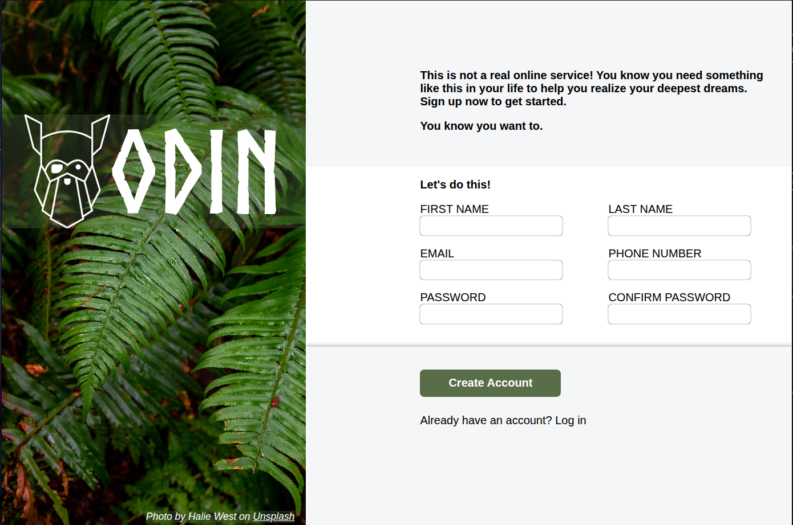

# Sign-up Form

A web-based sign-up form for an imaginary service, created as one of the projects from **The Odin Project: Intermediate HTML and CSS**

## Live Demo
[View Live Sign-up Form]()

## Features

- Background image **Photo by Halie West on Unsplash**. 
- Odin logo `assets/images/odin-lined.png`.
- External font **Norse Bold**.
- Text, telephone, email and password input fields.
- Native HTML validation using the `minlength` and `maxlength` attributes.
- Use of the `:user-invalid` and `:focus` pseudo-classes.
- Button for submitting the form.

## Technologies Used

- **HTML5**: Semantic layout and form structure.
- **CSS3**: `@font-face` for loading a custom font, Flexbox for layout, background properties, positining, and styling of interactive elements.

## What I Learned

- How to structure HTML forms
- How native HTML validation works.
- How to style different form controls with CSS.
- How to style different states of form controls.

## Challenges

- Creating the two-column layout while keeping the form section aligned.
- Adjusting the background image width and position.

